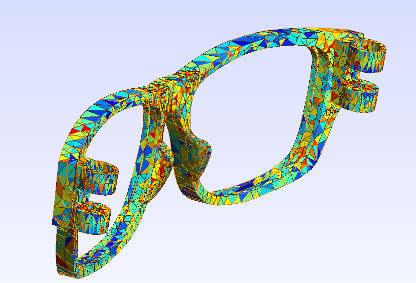

# FEM for Simulating Elastic Body

# Finite Elements Method for Simulating Elastic Body

## What do we do in simulating spring-mass system?

Recall what we did in simulating Spring-Mass system:

* Firstly, we describe deformation of springs using $\mathbf{F} = \frac{\mathbf{x}_1 - \mathbf{x}_2}{l_0}$. Something noticable here is that $\mathbf{F}$ is a vector and it is related to rotation of springs.

* Then, we define strain $G = |\mathbf{F}| - 1$. The purpose of $G$ is that it is a scale and only related to stretch and contraction of springs. So it is exactly what matters in calculating energy.

* After describing deformation, we use $ \Psi = \mu G^2 = \mu (\frac{\mathbf{x}_1 - \mathbf{x}_2}{l_0}-1)^2 $ to show the potential energy of $dm$ , where the $\mu$ is Young's modulus. Actually, the relationship between deformation and energy is found out by physicians (specifically, Hooke), at most time we only use it.

* So, the total energy of whole spring is $E = \Psi l_0 = \frac{1}{2}\frac{2\mu}{l_0}(|\mathbf{x}_1-\mathbf{x}_2|-l_0)^2$, where the $\frac{2\mu}{l_0}$ is $k$, which we're familiar with in physics class.

* At last, we use $F = -\frac{\partial E}{\partial \mathbf{x}}$ to calculate the force of two points of spring. Having force, we can advance the points and finish simulating.

An important thing is, density of energy $\Psi$ is assumed to be equally distributed in the spring, so we can calculate energy using $E = \Psi l_0$.

## So what we are going to do in FEM?
Actually, like spring-mass system, in FEM we devide the whole project into different "mesh". In 2D simulation we always use triangular and in 3D simulation we always use tetrahedron.

 
glasses divided by meshs

In FEM, a mesh is like a spring, we can calculate deformation of it and thus calculate energy of it. You can consider a mesh as a high-dimension spring.

To be specific, we take an example of triangle mesh. At first, the mesh has no energy, we call it stay in "Reference".

During the simulation, the mesh has displacement, it becomes:

We can define the relationship between $\mathbf{x}$ and $\mathbf{X}$ : $\mathbf{x} = \Phi(\mathbf{X})$. In linear FEM, we assume $\Phi$ is a linear function, so $\mathbf{x = FX + b}$. Then we can calculate $\mathbf{F = [x_1-x_0, x_2-x_0][X_1-X_0, X_2-X_0]^{-1}}$, where $\mathbf{F}$ is a $2\times 2$ matrix.

Then, we need a strain $\mathbf{G}$ to eliminate rotation and advecton in $\mathbf{F}$. In my code, I use $\mathbf{G = \frac{1}{2}(F^TF-I)}$, which is called Green Strain.

Next, we should calculate density of energy $\Psi$ in the mesh. In my code I use StVK model, which says $\Psi = \mu ||\mathbf{G}||_F^2 + \frac{\lambda}{2}tr(\mathbf{G})^2$. In this model, $\mu = \frac{k}{2(1+\nu)}, \lambda=\frac{k\nu}{(1+\nu)(1-2\nu)}$, where $k$ is Young's modulus and $\nu$ is Poisson's ratio.

With the same assumption in spring-mass system, we can calculate $E = V\Psi$. Then we can use $-\frac{\partial E}{\partial \mathbf{x}}$ to calculate force at vertices of triangular. But here is a problem: what is $\frac{\partial E}{\partial \mathbf{x}}$ ? To be honest, it is really difficult to deduce the final result. In the future I will put it in the Appendix, but now I can tell you the result directly: 
$$
\frac{\partial E}{\partial \mathbf{x}} = VP[\mathbf{X}_2-\mathbf{X}_0, \mathbf{X}_1-\mathbf{X}_0]^{-T}
$$
where $P = FG$, which is called Piola-Kirchhoff stress.

After caculating force, the main body of simulating is finished.

## Results
To summarize, the route of the algorithm is similar with simulating spring-mass system. But the FEM is not as simple as I write here. It can also be used to simulate fluid and other phenomenon. And in this article I use some conclusions in continuum mechanics. To research in such field is also a challengable task.

You can see my code on [github](https://github.com/QiruiFU/Taichi-simulation/blob/main/fem.py). The input is .msh file, which can be opened in Gmesh. The output is .vtk files in a sequence, which can be visualized in ParaView.

The result of my code has been published at [bilibili](https://www.bilibili.com/video/BV16q3GexE8D). I get all input files from [TetWild](https://github.com/Yixin-Hu/TetWild).
