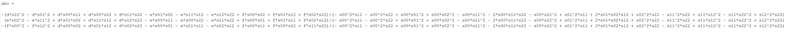

# Implicit MPM

# Implicit Update Scheme for MPM

The main purpose of this article is to talk about how to apply implicit update in MPM framework. To know more details about MPM, you can read [This SIGGRAPH 2016 Course Notes](https://www.math.ucla.edu/~cffjiang/research/mpmcourse/mpmcourse.pdf) and [A Material Point Method For Snow Simulation (Alexey Stomakhin et al., 2013)](https://www.disneyanimation.com/publications/a-material-point-method-for-snow-simulation/) .

## Framework of MPM

Currently, I prefer to use APIC scheme to transfer velocity between particles and grids. The framework I always use is listed here:

* **Particle to Grid**
* **Update Velocities on Grids**
* **Grid to Particle**
* **Advect Particles**
* **Update Deformation Gradient $\mathbf{F}$ on Particles**

The main difference between explicit and implicit MPM is *"Update Velocities on Grids"* step. In explicit MPM, we use $u_{i}^{n+1}=u_{i}^{n} + \Delta tm_i^{-1}(\mathbf{f}_{i}^{n}+m_i\mathbf{g})$ in this step, where $\mathbf{f}_i$ is the elastic force and $m_i\mathbf{g}$ is gravity. In most implementations, to reduce the computing time, we always compute $\mathbf{f}_i^n$ in P2G step:

$$
\mathbf{f}^n_i = \sum_p V_p^0 \frac{\partial \Psi}{\partial \mathbf{F}} (F_p^n)^T \nabla w_{ip}
$$

## Semi-Implicit Update on Grid
### What We Need to Do in Implicit MPM

In implicit MPM, we use $u_{i}^{n+1}=u_{i}^{n} + \Delta tm_i^{-1}( \mathbf{f}\_{i}^{n+1} +m\mathbf{g})$ to update velocities on grids. Since we can use $\frac{\partial\mathbf{f}}{\partial t} \Delta t$ to estimate $\Delta\mathbf{f}$:

$$
\begin{align*}
\mathbf{f}\_{i}^{n+1} &= \mathbf{f}\_{i}^{n} + \Delta t \sum_j \frac{\partial\mathbf{f}_i^n}{\partial\hat{x}_j} \frac{\partial\hat{x}_j}{\partial t} \\\\
&= \mathbf{f}\_{i}^{n} + \Delta t \sum_j \frac{\partial\mathbf{f}_i^n}{\partial\hat{x}_j}v_j^{n+1}
\end{align*}
$$

This method is called Semi-Implicit MPM.

Then we have:

$$
\begin{align*}
u_i^{n+1} = u_i^{n} + \Delta tm_i^{-1}(\mathbf{f}_{i}^{n}+m\mathbf{g}) + \Delta t^2 m_i^{-1} \sum_j \frac{\partial\mathbf{f}_i^n}{\partial\hat{x}_j}v_j^{n+1}
\end{align*}
$$

We can use $u^* = u_i^{n} + \Delta tm_i^{-1}(\mathbf{f}_{i}^{n}+m\mathbf{g})$ to represent the velocity in next time step we get in explicit MPM. Finally, we can write all thing in this:
$$
\begin{align*}
  u_i^{n+1} - \Delta t^2 m_i^{-1} \sum_j \frac{\partial\mathbf{f}_i^n}{\partial\hat{x}_j}u_j^{n+1} = u^* \\\\
  u_i^{n+1} - \Delta t m_i^{-1} \sum_j \frac{\partial\mathbf{f}_i^n}{\partial\hat{x}_j}\Delta tu_j^{n+1} = u^* \\\\
  u_i^{n+1} - \Delta t m_i^{-1} \sum_j \frac{\partial\mathbf{f}_i^n}{\partial\hat{x}_j}\delta \hat{x}_j = u^* \\\\
  u_i^{n+1} - \Delta t m_i^{-1} \sum_j \delta \mathbf{f}_j = u^* \\\\
\end{align*}
$$

Here, $\delta \mathbf{f}_j$ is a function of $u_i^{n+1}$. Thus we can write this equation into a form like:
$$
\mathbf{M}\mathbf{u}^{n+1} = \mathbf{u}^*
$$

where $\mathbf{u}^{n+1}$ and $\mathbf{u}^*$ are two really huge vectors and $\mathbf{M}$ is a matrix. Right now, our goal is to solve this equation. Since size of $\mathbf{M}$ is $(3N)\times(3N)$ in our problem ($N$ is the number of grids), we cannot represent $\mathbf{M}$ explicitly. But we can compute the effect when it's applied onto a vector, which means for a give $\mathbf{u}$, we can give you $\mathbf{Mu}$. In this way, we can represent $\mathbf{M}$ and solve this equation. Look at the left hand side of our equation, we only need to compute $\delta \mathbf{f}$ to get the result of  $\mathbf{Mu}$.

### How to Compute $\delta \mathbf{f}$

As the computation of $\mathbf{f}$ has benn shown before, we have:
$$
\begin{align*}
  \delta\mathbf{f}\_i &= \delta\sum_p V_p^0 \frac{\partial \Psi}{\partial \mathbf{F}} (F_p^n)^T \nabla w_{ip} \\\\
  &= \sum_p V_p^0 (\delta\frac{\partial \Psi}{\partial \mathbf{F}}) (F_p^n)^T \nabla w_{ip} \\\\
\end{align*}
$$

In different tasks, we have different constitutive models, so we will have different $\frac{\partial\Psi}{\partial\mathbf{F}}$ . Here, let's say we are using *(fixed) Corotated* model to describe the property of material:

$$
\begin{align*}
  \Psi(\mathbf{F}) = \mu ||\mathbf{F} - \mathbf{R}||^2_F + \frac{\lambda}{2}(J-1)^2 \\\\
  \frac{\partial\Psi}{\partial\mathbf{F}} = 2\mu(\mathbf{F}-\mathbf{R})+\lambda(J-1)J\mathbf{F}^{-T}
\end{align*}
$$

$J=\text{det}\mathbf{F}$ and $\mathbf{F}$ is written as $\mathbf{F}=\mathbf{RS}$ by polar decomposition, where $\mathbf{S}$ is a symmetric matrix and $\mathbf{R}$ is an orthonormal matrix. in this model
$$
\delta\frac{\partial \Psi}{\partial \mathbf{F}} = 2\mu(\delta\mathbf{F}-\delta\mathbf{R})+\lambda J\mathbf{F}^{-T}(J\mathbf{F}^{-T}:\delta\mathbf{F}) + \lambda(J-1)\delta(J\mathbf{F}^{-T})
$$

For the details of how we get this equation, you could read the Tech Report of [A Material Point Method For Snow Simulation (Alexey Stomakhin et al., 2013)](https://www.disneyanimation.com/publications/a-material-point-method-for-snow-simulation/).

Just a reminder, we need to compute this formula on particles. Firstly, for $\delta\mathbf{F}$, it's:
$$
\delta\mathbf{F}_p = \sum_j \Delta t u_j (\nabla w\_{jp})^T \mathbf{F}_p
$$

Second, $J\mathbf{F}^{-T}$ is called *cofactor matrix* of matrix $\mathbf{F}$. In 3D, it's :

This result is calculated in Matlab. Additionally, for each entry of $\delta(J\mathbf{F}^{-T})$, it's value equals to $\delta$ value of that entry of $J\mathbf{F}^{-T}$ . For example, $\delta(J\mathbf{F}^{-T})\_{00} = \delta\mathbf{F}\_{11}\mathbf{F}\_{22} + \mathbf{F}\_{11}\delta\mathbf{F}\_{22} - \delta\mathbf{F}\_{12}\mathbf{F}\_{21} - \mathbf{F}\_{12}\delta\mathbf{F}\_{21}$ . In this method, we can calculate $J\mathbf{F}^{-T}$ and $\delta(J\mathbf{F}^{-T})$

The final problem is $\delta\mathbf{R}$. We have:
$$
\begin{align*}
  \delta\mathbf{F} &= \delta\mathbf{RS} + \mathbf{R}\delta\mathbf{S} \\\\
  \mathbf{R}^T\delta\mathbf{F} &= \mathbf{R}^T\delta\mathbf{RS} + \delta\mathbf{S} \\\\
  \mathbf{R}^T\delta\mathbf{F} - (\mathbf{R}^T\delta\mathbf{F})^T  &= \mathbf{R}^T\delta\mathbf{RS} - \mathbf{S}(\delta\mathbf{R})^T\mathbf{R} \\\\
  \mathbf{R}^T\delta\mathbf{F} - (\mathbf{R}^T\delta\mathbf{F})^T &= \mathbf{R}^T\delta\mathbf{RS} + \mathbf{SR}^T\delta\mathbf{R}
\end{align*}
$$

The last step is because:
$$
\begin{align*}
  \delta(\mathbf{R}^T\mathbf{R}) &= \delta\mathbf{I} \\\\
  \delta\mathbf{R}^T\mathbf{R} + \mathbf{R}^T\delta\mathbf{R} &= 0
\end{align*}
$$

Or we can say $\mathbf{R}^T\delta\mathbf{R}$ is a skew-symmetric matrix. If we define:
$$
\mathbf{R}^T\delta\mathbf{F} - (\mathbf{R}^T\delta\mathbf{F})^T  = \mathbf{V} = 
\begin{bmatrix}
  0 & d & e \\\\
  -d & 0 & f \\\\
  -e & -f & 0
\end{bmatrix}
$$

$$
\mathbf{R}^T\delta\mathbf{R} = \mathbf{U} = 
\begin{bmatrix}
  0 & a & b \\\\
  -a & 0 & c \\\\
  -b & -c & 0
\end{bmatrix}
$$

Then we have $\mathbf{V} = \mathbf{US} + \mathbf{SU}$. In this equation, $d,e,f$ and $\mathbf{S}$ are known, so we can solve $a, b, c$:

The representations of $a, b, c$ are so long that It cannot be shown clearly here :( . An easier way to compute $a, b, c$ is we can convert this equation into :

and sovle this easier equation.

After getting $a, b, c$, we have $\mathbf{R}^T\delta\mathbf{R}$. Just pre-multiply $\mathbf{R}$ on it, we can have $\delta\mathbf{R}$.

## Implicit MPM

We have shown in the last section that in implicit MPM, we are solving:
$$
u^{n+1}_i = (u^n_i + \Delta t \mathbf{g}) + \Delta t m_i^{-1}\mathbf{f}^{n+1}_i
$$

At this time, we define $u^*=u^n_i + \Delta t \mathbf{g}$. So we are trying to solve a non-linear equation:
$$
m_i (u-u^\*) - \mathbf{f}_i^{n+1} \Delta t= 0
$$

Since $\mathbf{f}$ is also a function of $u$, this equation is really hard to solve. In implicit MPM, instead of estimating $\mathbf{f}^{n+1}$ , we convert this task into an optimization problem. If we define:
$$
E(\mathbf{u}) = \frac{1}{2}(\mathbf{u}-\mathbf{u}^\*)^T\mathbf{M}(\mathbf{u}-\mathbf{u}^\*) + \Phi(\mathbf{x}^n + \Delta t \mathbf{u})
$$

We could find that:
$$
\nabla_\mathbf{u}E = \mathbf{M}(\mathbf{u}-\mathbf{u}^\*) + \Delta t \frac{\partial \Phi}{\partial\mathbf{x}^{n+1}} = \mathbf{M}(\mathbf{u}-\mathbf{u}^\*) - \Delta t \mathbf{f}^{n+1}
$$

Thus, our goal is to find $\nabla_\mathbf{u}E=0$, or minimize $E(\mathbf{u})$ . Of course, the energy function $\Phi$ should have some properties, at least the potential energy function of $\mathbf{f}$ should exist. Some discussion about that can be found in : [Optimization Integrator for Large Time Steps (Theodore F. et al., 2015)](https://www.math.ucdavis.edu/~jteran/papers/GSSJT15.pdf) . One thing noticable here is we write $\mathbf{u}$ as a big vector. For example, if we have $1000$ active grids in 3D , then shape of $\mathbf{u}$ and $\nabla_\mathbf{u}E$ are both $(3000\times 1)$ .

### Optimization Methods

Firstly, for any given $\mathbf{u}$, we can compute the $\nabla_\mathbf{u}E$ easily like we did in explicit MPM. Based on it, an intuitive idea is to use gradient descent method to minimize $E(\mathbf{u})$.

A better way is Newton's Method. We all know that Newton's Method is an efficient iterative method for solving equations. Just like how we update $x$ in a scaler equation: $\Delta x = -\frac{f(x)}{f'(x)}$, in each iteration, $\Delta\mathbf{u} = -\mathbf{H}^{-1}\nabla E$, where $\mathbf{H} = \nabla(\nabla E)$ is a matrix. Newton's Method can converge quickly, but the drawback is we need to compute $\mathbf{H}$ and solve a linear equation $\mathbf{H}\Delta\mathbf{u}=-\nabla E$ in every single iteration. One interesting thing is that if you run Newton's Method for just one iteration, it's equivalent to semi-impicit MPM.

Another method is called L-BFGS, in which we don't have to compute $\mathbf{H}$ explicitly. I don't really know the theoretical details for this method right now, but the workflow of it can be found easily online.

