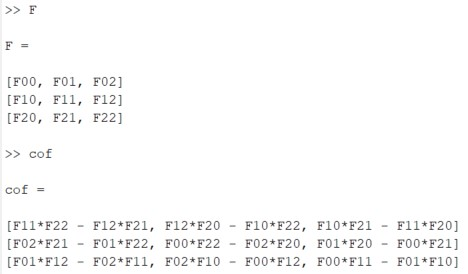

# Implicit MPM

# Implicit Update Scheme for MPM

The main purpose of this article is to talk about how to apply implicit update in MPM framework. To know more details about MPM, you can read [This SIGGRAPH 2016 Course Notes](https://www.math.ucla.edu/~cffjiang/research/mpmcourse/mpmcourse.pdf) and [A Material Point Method For Snow Simulation (Alexey Stomakhin et al., 2013)](https://www.disneyanimation.com/publications/a-material-point-method-for-snow-simulation/) .

## Notations

## Framework of MPM

Currently, I prefer to use APIC scheme to transfer velocity between particles and grids. The framework I always use is listed here:

* **Particle to Grid**
* **Update Velocities on Grids**
* **Grid to Particle**
* **Advect Particles**
* **Update Deformation Gradient $\mathbf{F}$ on Particles**

The main difference between explicit and implicit MPM is *"Update Velocities on Grids"* step. In explicit MPM, we use $u_{i}^{n+1}=u_{i}^{n} + \Delta tm_i^{-1}(\mathbf{f}_{i}^{n}+m\mathbf{g})$ in this step, where $\mathbf{f}_i$ is the elastic force and $m\mathbf{g}$ is gravity. In most implementations, to reduce the computing time, we always compute $\mathbf{f}_i^n$ in P2G step:

$$
\mathbf{f}^n_i = \sum_p V_p^0 \frac{\partial \Psi}{\partial \mathbf{F}} (F_p^n)^T \nabla w_{ip}
$$

## Implicit Update on Grid

In implicit MPM, we use $u_{i}^{n+1}=u_{i}^{n} + \Delta tm_i^{-1}( \mathbf{f}\_{i}^{n+1} +m\mathbf{g})$ to update velocities on grids. Since :
$$
\begin{align*}
\mathbf{f}\_{i}^{n+1} &= \mathbf{f}\_{i}^{n} + \Delta t \sum_j \frac{\partial\mathbf{f}_i^n}{\partial\hat{x}_j} \frac{\partial\hat{x}_j}{\partial t} \\\\
&= \mathbf{f}\_{i}^{n} + \Delta t \sum_j \frac{\partial\mathbf{f}_i^n}{\partial\hat{x}_j}v_j^{n+1}
\end{align*}
$$

Then we have:

$$
\begin{align*}
u_i^{n+1} = u_i^{n} + \Delta tm_i^{-1}(\mathbf{f}_{i}^{n}+m\mathbf{g}) + \Delta t^2 m_i^{-1} \sum_j \frac{\partial\mathbf{f}_i^n}{\partial\hat{x}_j}v_j^{n+1}
\end{align*}
$$

We can use $u^* = u_i^{n} + \Delta tm_i^{-1}(\mathbf{f}_{i}^{n}+m\mathbf{g})$ to represent the velocity in next time step we get in explicit MPM. Finally, we can write all thing in this:
$$
\begin{align*}
  u_i^{n+1} - \Delta t^2 m_i^{-1} \sum_j \frac{\partial\mathbf{f}_i^n}{\partial\hat{x}_j}u_j^{n+1} = u^* \\\\
  u_i^{n+1} - \Delta t m_i^{-1} \sum_j \frac{\partial\mathbf{f}_i^n}{\partial\hat{x}_j}\Delta tu_j^{n+1} = u^* \\\\
  u_i^{n+1} - \Delta t m_i^{-1} \sum_j \frac{\partial\mathbf{f}_i^n}{\partial\hat{x}_j}\delta \hat{x}_j = u^* \\\\
  u_i^{n+1} - \Delta t m_i^{-1} \sum_j \delta \mathbf{f}_j = u^* \\\\
\end{align*}
$$

Here, $\delta \mathbf{f}_j$ is a function of $u_i^{n+1}$. Thus we can write this equation into a form like:
$$
\mathbf{M}\mathbf{u}^{n+1} = \mathbf{u}^*
$$

where $\mathbf{u}^{n+1}$ and $\mathbf{u}^*$ are two really huge vectors and $\mathbf{M}$ is a matrix. Right now, our goal is to solve this equation. Since size of $\mathbf{M}$ is $(3N)\times(3N)$ in our problem ($N$ is the number of grids), we cannot represent $\mathbf{M}$ explicitly. But we can compute the effect when it's applied onto a vector, which means for a give $\mathbf{u}$, we can give you $\mathbf{Mu}$. In this way, we can represent $\mathbf{M}$ and solve this equation. Look at the left hand side of our equation, we only need to compute $\delta \mathbf{f}$ to get the result of  $\mathbf{Mu}$.

## How to Compute $\delta \mathbf{f}$

As the computation of $\mathbf{f}$ has benn shown before, we have:
$$
\begin{align*}
  \delta\mathbf{f}\_i &= \delta\sum_p V_p^0 \frac{\partial \Psi}{\partial \mathbf{F}} (F_p^n)^T \nabla w_{ip} \\\\
  &= \sum_p V_p^0 (\delta\frac{\partial \Psi}{\partial \mathbf{F}}) (F_p^n)^T \nabla w_{ip} \\\\
\end{align*}
$$

In different tasks, we have different constitutive models, so we will have different $\frac{\partial\Psi}{\partial\mathbf{F}}$ . Here, let's say we are using *(fixed) Corotated* model to describe the property of material:

$$
\begin{align*}
  \Psi(\mathbf{F}) = \mu ||\mathbf{F} - \mathbf{R}||^2_F + \frac{\lambda}{2}(J-1)^2 \\\\
  \frac{\partial\Psi}{\partial\mathbf{F}} = 2\mu(\mathbf{F}-\mathbf{R})+\lambda(J-1)J\mathbf{F}^{-T}
\end{align*}
$$

$J=\text{det}\mathbf{F}$ and $\mathbf{F}$ is written as $\mathbf{F}=\mathbf{RS}$ by polar decomposition, where $\mathbf{S}$ is a symmetric matrix and $\mathbf{R}$ is an orthonormal matrix. in this model
$$
\delta\frac{\partial \Psi}{\partial \mathbf{F}} = 2\mu(\delta\mathbf{F}-\delta\mathbf{R})+\lambda J\mathbf{F}^{-T}(J\mathbf{F}^{-T}:\delta\mathbf{F}) + \lambda(J-1)\delta(J\mathbf{F}^{-T})
$$

For the details of how we get this equation, you could read the Tech Report of [A Material Point Method For Snow Simulation (Alexey Stomakhin et al., 2013)](https://www.disneyanimation.com/publications/a-material-point-method-for-snow-simulation/).

Just a reminder, we need to compute this formula on particles. Firstly, for $\delta\mathbf{F}$, it's:
$$
\delta\mathbf{F}_p = \sum_j \Delta t u_j (\nabla w\_{jp})^T \mathbf{F}_p
$$

Second, $J\mathbf{F}^{-T}$ is called *cofactor matrix* of matrix $\mathbf{F}$. In 3D, it's :

This result is calculated in Matlab. Additionally, for each entry of $\delta(J\mathbf{F}^{-T})$, it's value equals to $\delta$ value of that entry of $J\mathbf{F}^{-T}$ . For example, $\delta(J\mathbf{F}^{-T})\_{00} = \delta\mathbf{F}\_{11}\delta\mathbf{F}\_{22}-\delta\mathbf{F}\_{12}\delta\mathbf{F}\_{21}$ . In this method, we can calculate $J\mathbf{F}^{-T}$ and $\delta(J\mathbf{F}^{-T})$

The final problem is $\delta\mathbf{R}$. We have:
$$
\begin{align*}
  \delta\mathbf{F} &= \delta\mathbf{RS} + \mathbf{R}\delta\mathbf{S} \\\\
  \mathbf{R}^T\delta\mathbf{F} &= \mathbf{R}^T\delta\mathbf{RS} + \delta\mathbf{S} \\\\
  \mathbf{R}^T\delta\mathbf{F} - (\mathbf{R}^T\delta\mathbf{F})^T  &= \mathbf{R}^T\delta\mathbf{RS} - \mathbf{S}(\delta\mathbf{R})^T\mathbf{R} \\\\
  \mathbf{R}^T\delta\mathbf{F} - (\mathbf{R}^T\delta\mathbf{F})^T &= \mathbf{R}^T\delta\mathbf{RS} + \mathbf{SR}^T\delta\mathbf{R}
\end{align*}
$$

The last step is because:
$$
\begin{align*}
  \delta(\mathbf{R}^T\mathbf{R}) &= \delta\mathbf{I} \\\\
  \delta\mathbf{R}^T\mathbf{R} + \mathbf{R}^T\delta\mathbf{R} &= 0
\end{align*}
$$

Or we can say $\mathbf{R}^T\delta\mathbf{R}$ is a skew-symmetric matrix. If we define:
$$
\mathbf{R}^T\delta\mathbf{F} - (\mathbf{R}^T\delta\mathbf{F})^T  = \mathbf{V} = 
\begin{bmatrix}
  0 & d & e \\\\
  -d & 0 & f \\\\
  -e & -f & 0
\end{bmatrix}
$$

$$
\mathbf{R}^T\delta\mathbf{R} = \mathbf{U} = 
\begin{bmatrix}
  0 & a & b \\\\
  -a & 0 & c \\\\
  -b & -c & 0
\end{bmatrix}
$$

Then we have $\mathbf{V} = \mathbf{US} + \mathbf{SU}$. In this equation, $d,e,f$ and $\mathbf{S}$ are known, so we can solve $a, b, c$:

The representations of $a, b, c$ are so long that It cannot be shown clearly here :( . An easier way to compute $a, b, c$ is we can convert this equation into :

and sovle this easier equation.

After getting $a, b, c$, we have $\mathbf{R}^T\delta\mathbf{R}$. Just pre-multiply $\mathbf{R}$ on it, we can have $\delta\mathbf{R}$.

## Summary
By now, you can find the process of implicit update of MPM is really complicated. A main reference of this article is this repo: [snow](https://github.com/Azmisov/snow/tree/master). You can find more details of mathmatics and code in it.

Another important material is [Optimization Integrator for Large Time Steps (Theodore F. et al., 2015)](https://www.math.ucdavis.edu/~jteran/papers/GSSJT15.pdf) . I am not very sure what's the difference between two kinds of methods.
