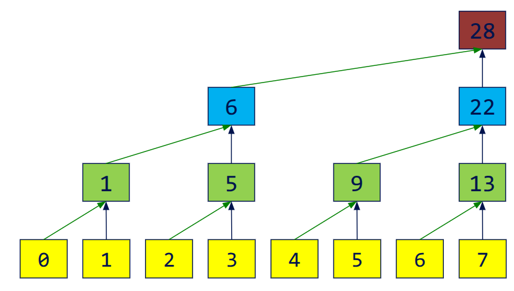
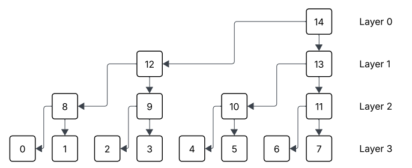

# Compute Exclusive Prefix Sum with CUDA


## Problem Description

In this blog, we want to talk about an algorithm which can compute prefix sum (or pre-sum) of an array in parallel. Formally, for an input array `a[N]`, we want an output array `c[N]` satisfying :
$$
c[i] = \sum_{0\leq j < i} a[j]
$$

Since it doesn't contain the value `a[i]`, we call it "exclusive pre-sum".

## Fenwick Tree
In sequential implementation, this problem is realy easy and intuitive. However, we also have a data structure called Binary Index Tree or "Fenwick Tree", which is designed for this scene: if we need to update an element in `a[N]`, how could we get new `c[N]` quicker? In naive method, the time consumed on updating one change is `O(N)`. Fenwick Tree is smartly designed so we can do it in `O(logN)`. In fact, our parallel algorithm is based on this data structure, please make sure you understand it before reading the next parts. Here is a [blog](https://cp-algorithms.com/data_structures/fenwick.html) I think helpful. 

## Our Method 
### Overview
In general, the idea of this parallel algorithm is to build Binary Index Tree at first, which is stored in `b[N]`. Then compute `c[i]` for each `i` in parallel. Sometimes we call first step "up sweep" and second step "down sweep", indicating the direction we are working on the binary tree.

### Up Sweep
In Up-Sweep, we need to build the binary tree in parallel layer by layer. For each layer, we add the value of left son to the right son, which becomes the father node of them in the next layer. Here is a digram illustrating this process:

<p align = "center">

</p>

After this, we would have a new array `b[N]`, storing the Binary Index Tree we care about. In sequential world, the time complexity is `O(NlogN)`, but here it's `O(logN)`.

### Down Sweep
In Down-Sweep, we need to push all values downwards, then get the `c[N]` we want. To be specific, during the Down-Sweep, we want `c[i]` to be the exclusive pre-sum value of range represented by this node (Thanks to my English this sentence may read weird). This process is also layer by layer. For example, we have finished the layer 1, which means node `13` storing the pre-sum value of `0~3`, since the range represented by node `13` is `4~7` in this layer. At the same time, the node `12` represents range `0~3` in this layer, there is nothing on its left, so node `12` is `0` right now.

With a finished layer, how could we compute the next layer? In this example, we need to compute node `10` and `11` based on node `13`. Apparently, node `10` should have the same value with node `13` since they have the same left end. For `11`, its left end is the right end of node `10`, which tells us its value is the sum of node `10` and `13` ! The reason we can do that is in Up-Sweep, although we store a tree in an array and lost some middle values, the value of node `10` is not erased. We can just read `b[5]` to get the sum of range `4~5` in the origin array.

For the first layer, because that node represents whole array, nothing is on its left, we can set it to zero direclty.

<p align = "center">

</p>

To summarize, we set `c[N-1]` to `0` at first. Then for i-th layer, we have:
```python
for node k in layer (i-1):
    c[left-son(k)] = c[k]
    c[right-son(k)] = c[k] + b[left-son(k)]
```

In real implementation, we don't have to have three different arrays or any tree structure, everything can be done in only one array. In each layer, the computation is parallelized. Another issue is this method only works on the power-of-2 length. We need to extend the size of input array to the next power of 2.

## Acceleration with Shared Memory
If you try this method in CUDA using global memory, it's really slow. It's because we need to visit lots of non-contiguous global memory. To optimize, we can use the shared memory in CUDA. However, shared memory is only available for threads in the same block. For each block, we can compute the exclusive pre-sum for it and record the sum of this block. After this step, for each element in this block, we should add it with all recorded summations of blocks before it. How could we get the sum of all this recorded values? That's another exclusive pre-sum problem with smaller size! Then, we can handle this problem recursively until we only have one block.

Here is a pseudocode:

``` C
__global__ void kernel(int *array, int *block_sum){
    __shared__ cache[size];
    
    copy value from global to shared;

    UpSweep(); // only for values in this block

    block_sum[blockid] = cache[size-1];
    cache[size-1] = 0;

    DownSweep(); // only for values in this block

    copy value from shared to global;
}

void preSum(int *array){
    compute block_cnt
    int *block_sum;
    kernel(array, block_sum);
    if(block_cnt > 1){
        preSum(block_sum);

        // you can write another kernel to finish this loop
        for i in array {
            block_id = i / block_size;
            array[i] += block_sum[block_id];
        }
    }
    // array is good now
}
```

You can find my implementation for this algorithm in this [repo](https://github.com/QiruiFU/565-P2). I think it's so cool since the usage of shared memory can accelerate so much. It also leads to a further problem: what if the input array is so long that we don't have enough memory to run it recursively? Maybe we have some more powerful algorithms Haha :) 
