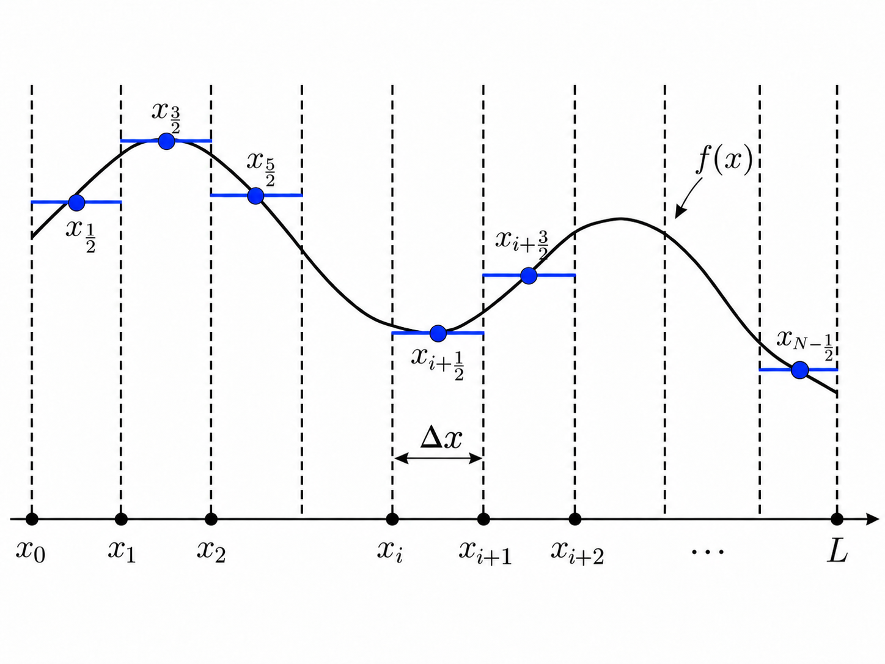
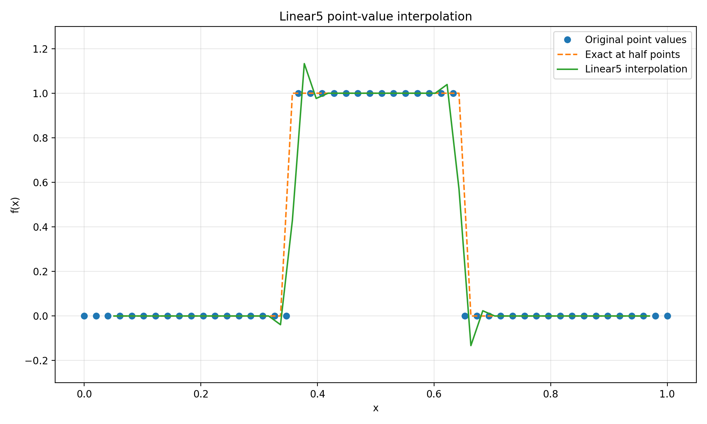
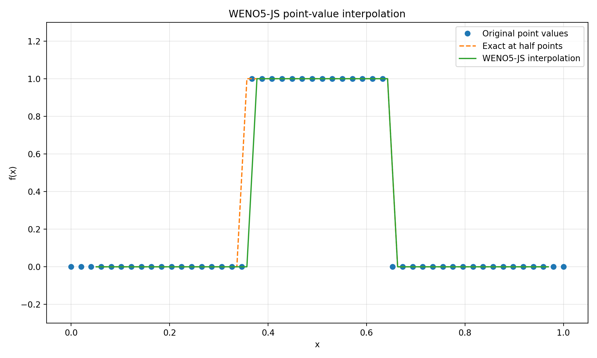

# WENO Reconstruction


# WENO Reconstruction

## Background

In many numerical tasks, a continuous function is represented by discrete samples and reconstructed when values between sample locations are needed. In this post, we consider a function $f(x)$ defined on the interval $[0, L]$.

We divide the interval into $N$ uniform subintervals with grid spacing

$$
\Delta x = \frac{L}{N}.
$$

The grid points are located at

$$
x_i = i\Delta x, \qquad i = 0, 1, \ldots, N,
$$

and we store samples of the function at midpoints of subintervals:

$$
f[i] = f(x_{i+\frac{1}{2}}).
$$

Our goal is to reconstruct accurate approximations at grid points $f(x_{i+1})$.

<p align = "center">

</p>

## Continuous Functions

The most intuitive approach is to assume that the function between two grid points is a straight line. Then $f(x_{i+1})$ is easy to approximate:
$$
  f(x_{i+1}) = f(x_{i+\frac{1}{2}}) + \frac{1}{2} \left(\frac{f(x_{i+\frac{3}{2}}) - f(x_{i+\frac{1}{2}})}{\Delta x} \right).
$$

Obviously, this approximation is first-order accurate. To achieve higher accuracy, we can use:
$$
f(x_{i+1}) = -\frac{1}{8} f(x_{i-\frac{1}{2}}) + \frac{3}{4} f(x_{i+\frac{1}{2}}) + \frac{3}{8} f(x_{i+\frac{3}{2}}),
$$
which requires three samples. It is straightforward to derive reconstruction formulas of arbitrary order for this problem. As $\Delta x$ becomes smaller, these formulas can provide accurate values for smooth functions. However, if we consider a discontinuous function:
$$
f(x) =
\begin{cases}
  1,\  0.35 < x \leq 0.65, \\\
  0,\ \text{otherwise},
\end{cases}
$$
and use a fifth-order estimation, we obtain:

<p align = "center">

</p>

The oscillation near the discontinuity is the so-called Gibbs phenomenon.

## Discontinuous Functions

For discontinuous functions and functions with sharp transitions, we need a special method. Essentially Non-Oscillatory (ENO) schemes were developed for this problem. Their core idea is to construct multiple candidates and select the smoothest one. Specifically, to estimate $f(x_{i+1})$, we have three candidate stencils: $\\{x_{i-\frac{5}{2}}, x_{i-\frac{3}{2}}, x_{i-\frac{1}{2}}\\}$, $\\{x_{i-\frac{3}{2}}, x_{i-\frac{1}{2}}, x_{i+\frac{1}{2}}\\}$, and $\\{x_{i-\frac{1}{2}}, x_{i+\frac{1}{2}}, x_{i+\frac{3}{2}}\\}$, each of which provides an interpolation result. To select the smoothest one, we can use the stencil with the smallest second divided difference:
$$
\frac{f(x_2) - 2f(x_1) + f(x_0)}{2\Delta x^2}.
$$

ENO works well and can eliminate spurious oscillations. However, the two unselected stencils are wasted. To make the method more efficient and achieve higher order, we seek to use all of them. We now have three estimates for $f(x_{i+1})$:
$$
q_0 = \frac{3}{8} f(x_{i-\frac{5}{2}}) - \frac{5}{4} f(x_{i-\frac{3}{2}}) + \frac{15}{8} f(x_{i-\frac{1}{2}}),
$$
$$
q_1 = -\frac{1}{8} f(x_{i-\frac{3}{2}}) + \frac{3}{4} f(x_{i-\frac{1}{2}}) + \frac{3}{8} f(x_{i+\frac{1}{2}}),
$$
$$
q_2 = \frac{3}{8} f(x_{i-\frac{1}{2}}) + \frac{3}{4} f(x_{i+\frac{1}{2}}) - \frac{1}{8} f(x_{i+\frac{3}{2}}),
$$

and we can combine them using weights:
$$
f(x_{i+1}) = w_0 q_0 + w_1 q_1 + w_2 q_2,
$$

where $w_0 + w_1 + w_2 = 1$. For a smooth function, we can use $w_0 = \frac{1}{16}, w_1 = \frac{10}{16}, w_2 = \frac{5}{16}$ to recover a fifth-order reconstruction. Near a discontinuity, where Gibbs-type oscillations may occur, we need a mechanism that adjusts the weights automatically.

## Weighted ENO

The remaining problem is how to determine the three weights: $w_0, w_1, w_2$. In ENO, we use the second divided difference as an indicator of smoothness, assigning a weight of $1$ to the selected stencil and $0$ to the others. In WENO, we combine all candidates, increasing a stencil's weight when it is smooth and decreasing it when the function varies sharply. We can use the function values at the sample points to quantify the smoothness of each stencil:

$$
\begin{align*}
\beta_0 &=
\frac{13}{12}
\left[
f\left(x_{i-\frac{5}{2}}\right)
-2f\left(x_{i-\frac{3}{2}}\right)
+f\left(x_{i-\frac{1}{2}}\right)
\right]^2
+
\frac{1}{4}
\left[
f\left(x_{i-\frac{5}{2}}\right)
-4f\left(x_{i-\frac{3}{2}}\right)
+3f\left(x_{i-\frac{1}{2}}\right)
\right]^2, \\\
\beta_1 &=
\frac{13}{12}
\left[
f\left(x_{i-\frac{3}{2}}\right)
-2f\left(x_{i-\frac{1}{2}}\right)
+f\left(x_{i+\frac{1}{2}}\right)
\right]^2
+
\frac{1}{4}
\left[
f\left(x_{i-\frac{3}{2}}\right)
-f\left(x_{i+\frac{1}{2}}\right)
\right]^2, \\\
\beta_2 &=
\frac{13}{12}
\left[
f\left(x_{i-\frac{1}{2}}\right)
-2f\left(x_{i+\frac{1}{2}}\right)
+f\left(x_{i+\frac{3}{2}}\right)
\right]^2
+
\frac{1}{4}
\left[
3f\left(x_{i-\frac{1}{2}}\right)
-4f\left(x_{i+\frac{1}{2}}\right)
+f\left(x_{i+\frac{3}{2}}\right)
\right]^2.
\end{align*}
$$

For each stencil, a larger $\beta$ indicates less smoothness and therefore a smaller weight $w$. Thus:
$$
  w_i \propto \frac{1}{\beta_i^2}.
$$

Since $w_0 + w_1 + w_2 = 1$ and $\beta$ may be $0$, we define
$$
  \alpha_i = \frac{d_i}{(\epsilon + \beta_i)^2},
$$

where $d_i$ is the corresponding linear weight used in smooth regions. After normalization, we obtain:

$$
  w_i = \frac{\alpha_i}{\alpha_0 + \alpha_1 + \alpha_2}.
$$

Finally, the estimate becomes
$$
f(x_{i+1}) = w_0 q_0 + w_1 q_1 + w_2 q_2.
$$

With WENO, our reconstruction result is:

<p align = "center">

</p>

It looks much better.

## Usage in FVM

WENO is mainly used in CFD to handle shock waves and discontinuous fields. In the Finite Volume Method (FVM), we reconstruct the left and right states at interfaces between neighboring cells to compute numerical fluxes. WENO is especially useful when high accuracy is desired and a shock wave lies near the reconstruction stencil. It is worth noting that the FVM coefficients are different from those used here because FVM reconstruction is typically based on cell averages; conservation of mass, momentum, and energy is then enforced through the numerical flux. The underlying idea, however, is the same.

## Code

``` python
import numpy as np
import matplotlib.pyplot as plt


def linear5_interpolation(um2, um1, ui, up1, up2):
    return (
          3.0 / 128.0 * um2
        - 5.0 / 32.0  * um1
        + 45.0 / 64.0 * ui
        + 15.0 / 32.0 * up1
        - 5.0 / 128.0 * up2
    )


def weno5_interpolation(um2, um1, ui, up1, up2, eps=1.0e-6):
    q0 = (
          3.0 / 8.0 * um2
        - 5.0 / 4.0 * um1
        + 15.0 / 8.0 * ui
    )

    q1 = (
        - 1.0 / 8.0 * um1
        + 3.0 / 4.0 * ui
        + 3.0 / 8.0 * up1
    )

    q2 = (
          3.0 / 8.0 * ui
        + 3.0 / 4.0 * up1
        - 1.0 / 8.0 * up2
    )

    beta0 = (
          13.0 / 12.0 * (um2 - 2.0 * um1 + ui) ** 2
        + 1.0 / 4.0 * (um2 - 4.0 * um1 + 3.0 * ui) ** 2
    )

    beta1 = (
          13.0 / 12.0 * (um1 - 2.0 * ui + up1) ** 2
        + 1.0 / 4.0 * (um1 - up1) ** 2
    )

    beta2 = (
          13.0 / 12.0 * (ui - 2.0 * up1 + up2) ** 2
        + 1.0 / 4.0 * (3.0 * ui - 4.0 * up1 + up2) ** 2
    )

    d0 = 1.0 / 16.0
    d1 = 10.0 / 16.0
    d2 = 5.0 / 16.0

    alpha0 = d0 / (eps + beta0) ** 2
    alpha1 = d1 / (eps + beta1) ** 2
    alpha2 = d2 / (eps + beta2) ** 2

    alpha_sum = alpha0 + alpha1 + alpha2

    w0 = alpha0 / alpha_sum
    w1 = alpha1 / alpha_sum
    w2 = alpha2 / alpha_sum

    value = w0 * q0 + w1 * q1 + w2 * q2

    return value


def reconstruct_all_half_points(x, u, method="weno"):
    n = len(x)

    x_half = []
    u_half = []

    for i in range(2, n - 2):

        um2 = u[i - 2]
        um1 = u[i - 1]
        ui  = u[i]
        up1 = u[i + 1]
        up2 = u[i + 2]

        if method == "weno":
            value = weno5_interpolation(
                um2, um1, ui, up1, up2
            )
        elif method == "linear":
            value = linear5_interpolation(
                um2, um1, ui, up1, up2
            )
        else:
            raise ValueError("method must be 'weno' or 'linear'")

        x_half.append(0.5 * (x[i] + x[i + 1]))
        u_half.append(value)

    return np.asarray(x_half), np.asarray(u_half)


def discontinuous_function(x):
    return np.where(
        (x >= 0.35) & (x <= 0.65),
        1.0,
        0.0
    )


def run_discontinuous_demo():
    n = 50
    x = np.linspace(0.0, 1.0, n)
    u = discontinuous_function(x)

    x_linear, u_linear = reconstruct_all_half_points(
        x, u, method="linear"
    )

    x_weno, u_weno = reconstruct_all_half_points(
        x, u, method="weno"
    )

    exact = discontinuous_function(x_weno)

    print("=" * 60)
    print("Discontinuous-function test")
    print("=" * 60)
    print("The important region is near x = 0.35 and x = 0.65.")
    print("Linear interpolation may overshoot/undershoot there,")
    print("while WENO reduces the contribution of nonsmooth stencils.")
    print()

    plots = (
        (
            "Linear5 point-value interpolation",
            "weno_interpolation_linear5.png",
            (
                (x, u, "o", "Original point values"),
                (x_linear, exact, "--", "Exact at half points"),
                (x_linear, u_linear, "-", "Linear5 interpolation"),
            ),
        ),
        (
            "WENO5-JS point-value interpolation",
            "weno_interpolation_weno5_js.png",
            (
                (x, u, "o", "Original point values"),
                (x_weno, exact, "--", "Exact at half points"),
                (x_weno, u_weno, "-", "WENO5-JS interpolation"),
            ),
        ),
    )

    for title, filename, curves in plots:
        plt.figure(figsize=(10, 6))
        for x_values, u_values, style, label in curves:
            plt.plot(x_values, u_values, style, label=label)

        plt.xlabel("x")
        plt.ylabel("f(x)")
        plt.title(title)
        plt.legend()
        plt.grid(alpha=0.3)
        plt.ylim(-0.3, 1.3)
        plt.tight_layout()
        plt.savefig(filename, dpi=200)

    plt.show()


if __name__ == "__main__":
    run_discontinuous_demo()

```
